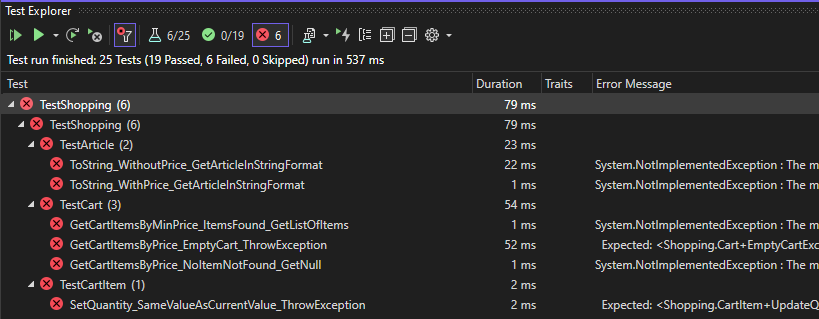

# 226a - Shopping - Eval

## Sujet à traiter
Application de gestion de panier de courses.

### Prise en main du code

1)  Récupérer le dépôt

```
    git clone <url du dépôt>
```
   
2) Réaliser la première compilation. Il est important que le réseau soit disponible. Le gestionnaire de dépendences (Nguet) en a besoin pour fonctionner correctement.

```
3>Done building project "TestShopping.csproj".
========== Build: 3 succeeded, 0 failed, 0 up-to-date, 0 skipped ==========
========== Build started at 18:27 and took 00.913 seconds ==========
```

3) Lancer ensuite tous les tests du projet.



### Moyens à disposition

* Un environnement de développement Visual Studio 2022 Entreprise.
* Tout le code produit durant le cours.
* Le réseau est exclu (excepté pour la première compilation) tout comme le travail collaboratif.
* 45 minutes.

### Livrables attendus
* Une archive compressée contenant **uniquement** les trois classes métiers (Article.cs, CartItem.cs et Cart.cs).

* Le nommage de l'archive : <nomDeFamille_TDD>.zip.

* Les modalités de livraison spécifiques sont à définir avec votre animateur/trice.

### Evaluation

*Généralités*
* Vous devez réussir à passer les tests qui sont actuellement en erreur.
* Ne pas déstabiliser les tests actuels.
* Les valeurs retournées par les classes métiers doivent être calculées (pas de retour codé en dur)

*Qualité du livrable*
* Respect des consignes de livraison.
* Respect des principes POO.
* Les classes de tests ne doivent avoir subi aucune modification.

**Notation**

    Note = (nbPointsObtenus/nbPointsMax)/5+1

**Auteur**

Nicolas Glassey

1-NOV-2023
